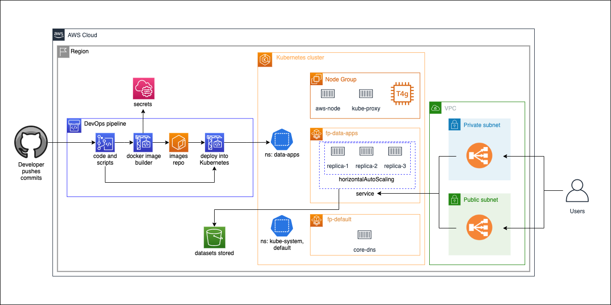

# data-app-on-eks

## About me

This project is a suggestion about how it's possible to build and delivery data apps quickly, by using technologies such as:
-  Python
-  AWS Data Wrangler
-  Streamlit
-  Amazon Elastic Kubernetes Service
-  AWS DevOps stack

In order to accelerate the delivery of the apps, we offer a model of a CI/CD pipeline using many modern and reliable tools from AWS. Responding to every change of the code, building new versions of Docker images and finally deploying into the Kubernetes cluster.

## Datasets

The datasets used in this project were processed using the project [myanimelist-data-collector](https://github.com/lmassaoy/myanimelist-data-collector). A web scrap project capable to download data of thousands of titles of anime. Transforming the data from json to parquet, in order to offer the best performance on analytics tasks.

## The App

The application built in Python using AWS Data Wrangler and Streamlit is a sample about how easy and fast you can build applications to navigate your users/customers through **Data Visualization**, **Data Analysis**, and **ML/IA solutions**.

It doesn't require expertise with front-end techologies, thanks to Streamlit resources you can build the back-end and the front-end only using the framework.

If you liked what you've read so far, please check the [Streamlit page](https://streamlit.io/) to know more about this amazing solution.

## How To

Please follow the [link](cloudformation/README.md) to understand how to proceed.