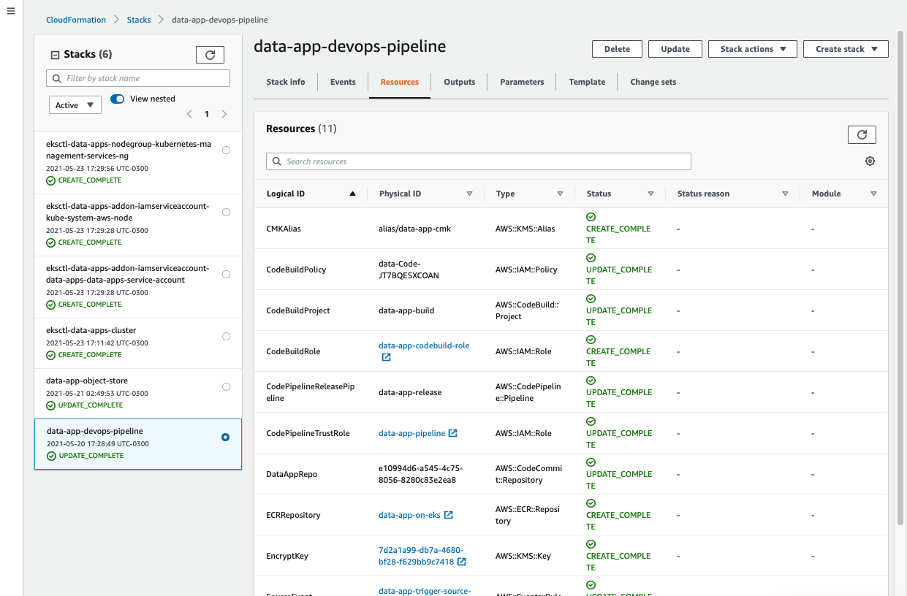
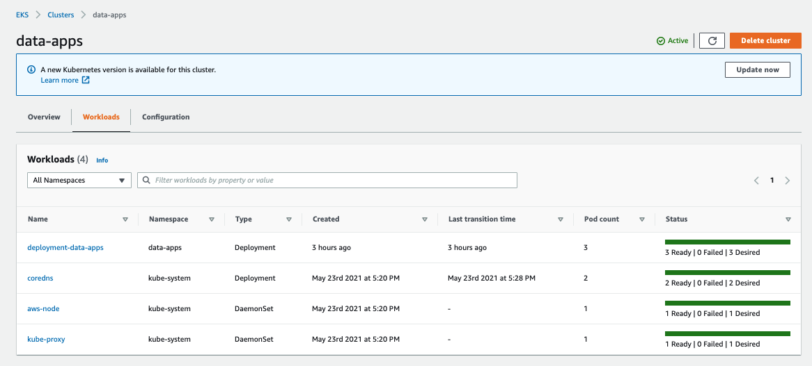
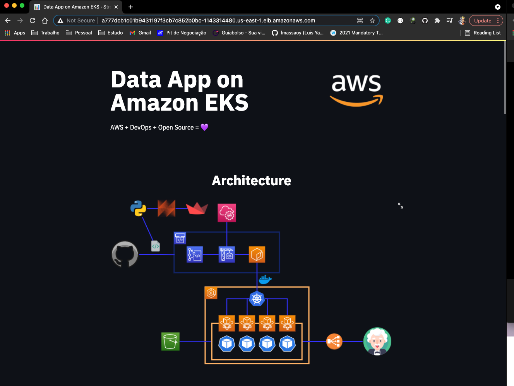

# Building the DevOps Pipeline

## Pre-Reqs
- AWS CLI already configured (version >= 2.1.6)
- kubectl (latest)
- export AWS_ACCOUNT=<your_account_id>
- export AWS_REGION=<your_region>
- Docker Hub credentials


## CloudFormation - Building the Pipeline

What's going to be created:
- a CMK
- some IAM policies (for IAM roles)
- some IAM roles (for DevOps services)
- an AWS CodeCommit repository
- an Amazon ECR repository
- an AWS CodeBuild project
- an AWS CodePipeline pipeline
- an Amazon EventBridge rule (event)

Run the following command:

```
$ aws cloudformation deploy \
    --template-file cloudformation/apps/devops-pipeline/devops-pipeline.yaml \
    --stack-name data-app-devops-pipeline \
    --capabilities CAPABILITY_NAMED_IAM \
    --tags ProjectName=DataAppOnEKS
```



## SSM Parameter: SecureString (not supported in AWS CloudFormation)

Please create the following parameters encrypting the parameters using the CMK created in the CloudFormation stack.

Use the DockerHub credentials inside the parameters


## Allowing AWS CodeBuild role to execute actions on the Kubernetes cluster

Update the mapRoles inside the aws-auth ConfigMap
```
$ kubectl edit configmap aws-auth -n kube-system
```
```
mapRoles: |
  - rolearn: arn:aws:iam::<your_account_id>:role/data-app-codebuild-role
    username: data-app-codebuild-role
    groups:
      - system:masters
```

## Populating our CodeCommit repository

### Important

In order to clone the repository, you should set up your GIT credentials (https://docs.aws.amazon.com/codecommit/latest/userguide/setting-up-gc.html). Make sure you already have them before proceeding.

Run the following command to clone the CodeCommit Repository into your local repo.
```
$ sh cloudformation/apps/devops-pipeline/git-clone.sh
```

Now let's copy the scripts of our Data App into the repository and push them into the AWS CodeCommit repository.
```
$ sh cloudformation/apps/devops-pipeline/create-deployment-file.sh
$ sh cloudformation/apps/devops-pipeline/push-to-codecommit.sh
```
Because of the integration of the AWS CodePipeline, once the push is done, the workflow will build a Docker image into your repository in Amazon ECR, and will wait for the deployment's approval (manual task). Once it's approved, the deployment task will create the result resources into the Amazon EKS cluster.




## Checking the results

Check if the service is already exposed getting the 'EXTERNAL-IP'. 
```
$ kubectl get service -n data-apps
```
Output:
```
NAME               TYPE           CLUSTER-IP       EXTERNAL-IP                                                               PORT(S)        AGE
data-apps-on-eks   LoadBalancer   10.100.120.229   a777dcb1c01b9431197f3cb7c852b0bc-1143314480.us-east-1.elb.amazonaws.com   80:31641/TCP   8sus-east-1.elb.amazonaws.com   80:32174/TCP   7m54s
```

Make sure the pods are running then you can access the Classic Elastic Load Balancer URL exposed by Amazon EKS.



It's possible the app faces problems to render images. Currently there's a known bug under fix (https://github.com/streamlit/streamlit/issues/1294).


