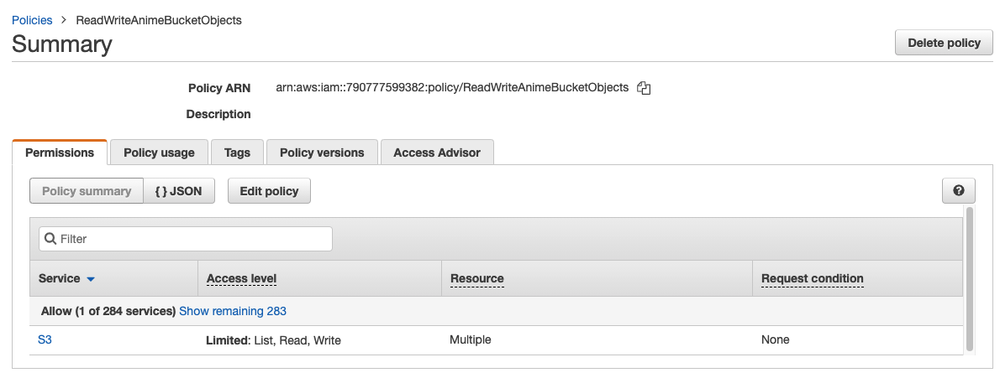

# Build your own Amazon EKS cluster

## Pre-reqs:

- eksctl (version >= 0.50.0)
    - https://eksctl.io/introduction/
- kubectl (latest)
- AWS CLI already configured (version >= 2.1.6)
- export AWS_ACCOUNT=<your_account_id>
    - example: 790777599382

## Step-by-Step

### Security

1. Create a policy that allows our containers to access the AWS components

    Run the following command and save the Arn for later:
    ```
    $ aws iam create-policy --policy-name ReadWriteAnimeBucketObjects --policy-document file://cloudformation/infra/eks-cluster/read-write-s3-policy-doc.json
    ```
    

### Cluster + Fargate Profile + Node Group + Service Account

1. Creating the cluster and its resources

    Running the following command creates a stack at CloudFormation that will build the Amazon EKS clusters using AWS EC2 Auto-Scaling (Node Group), Fargate profiles, and IAM role (Service Account):
    ```
    $ eksctl create cluster -f cloudformation/infra/eks-cluster/data-apps-cluster.yaml
    ```
    

2. Testing the configuration using kubectl

    Running the following command:
    ```
    $ kubectl get svc
    ```
    the output should be like this:
    ```
    NAME         TYPE        CLUSTER-IP   EXTERNAL-IP   PORT(S)   AGE
    kubernetes   ClusterIP   172.20.0.1   <none>        443/TCP   31m
    ```
    This means you're ready to start using the EKS cluster.

<!-- 3. Create a Fargate Profile which will be used with the applications soon, and a Namespace named as "data-apps":
    
    Create a new Fargate Profile for the Namespace: "data-apps":

    Create the Namespace:

    ```
    $ kubectl create namespace data-apps
    ```
    
    **Skip the following command if you chosed the Option 1.A**

    ```
    $ eksctl create fargateprofile --namespace data-apps --cluster kube-cluster --name fp-data-apps
    ``` -->

<!-- 5. Create an IAM OIDC identity provider

    ```
    $ eksctl utils associate-iam-oidc-provider --cluster data-apps-cluster --approve
    ```

6. Create an IAM Service Role for the containers

    ```
    $ eksctl create iamserviceaccount \
        --name data-apps-service-account \
        --namespace data-apps \
        --cluster data-apps-cluster \
        --attach-policy-arn arn:aws:iam::$AWS_ACCOUNT:policy/ReadWriteAnimeBucketObjects \
        --approve \
        --override-existing-serviceaccounts
    ``` -->

## Optional Tasks

### Cluster Monitoring Tools

1. Setup the Kubernetes Metrics Server
    - https://docs.aws.amazon.com/eks/latest/userguide/metrics-server.html

2. Setup Kubernetes Dashboard (this task needs the Kubernetes Metrics Server running)
    - https://docs.aws.amazon.com/eks/latest/userguide/dashboard-tutorial.html

3. Setup Prometheus + Grafana
    - install Helm: https://docs.aws.amazon.com/eks/latest/userguide/helm.html
    - add a nodegroup (Prometheus' deployments need EBS volumes in order to work properly):
        ```
        $ eksctl create nodegroup --config-file=cloudformation/infra/eks-cluster/monitoring-scripts/prometheus-ng.yaml
        ```
    - https://www.eksworkshop.com/intermediate/240_monitoring/